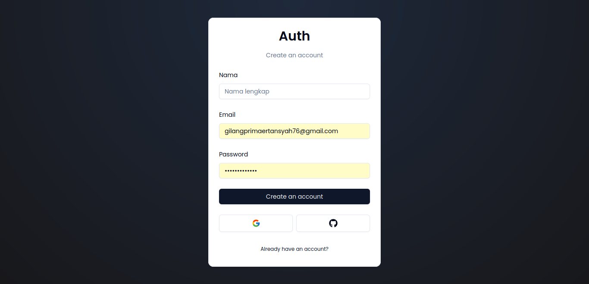
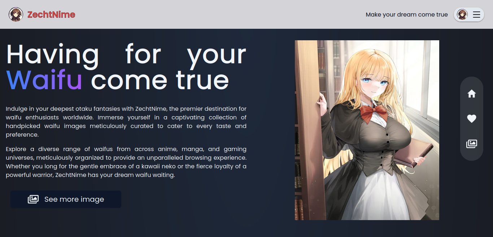
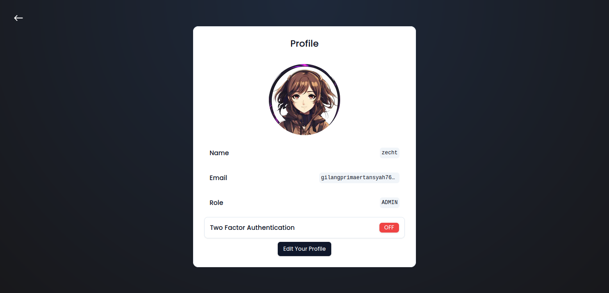

# ZechtNime

ZechtNime is a platform designed to make your dream come true by offering personalized experiences and guidance. 

## Screenshots

### Screenshot 1

**Description:**
The first screenshot displays the welcome page of ZechtNime. The central focus is on a welcoming message that reads "Welcome to ZechtNime" in bold, with the subtitle "Make your dream come true" just below. The interface features a circular avatar of an anime character, adding a personal and engaging touch to the website. The page includes a prominent "Sign in" button, inviting users to log in and start their journey with ZechtNime.

### Screenshot 2

**Description:**
The second screenshot showcases the login page of ZechtNime. This page is designed to welcome back returning users with a simple and intuitive interface. It features fields for entering an email and password, a "Forgot password" link for account recovery, and a "Login" button to access the platform. Additionally, there are options for logging in via Google or GitHub, offering users flexible and convenient authentication methods.

### Screenshot 3

**Description:**
The third screenshot illustrates the account creation page of ZechtNime. This page allows new users to sign up by providing their full name, email address, and a password. The layout is clean and user-friendly, featuring clearly labeled fields and a prominent "Create an account" button. Additionally, users have the option to sign up using their Google or GitHub accounts, ensuring a seamless registration process. A link at the bottom encourages users who already have an account to log in instead.

### Screenshot 4

**Description:**
The fourth screenshot highlights the main landing page of ZechtNime. This page greets users with a bold and engaging headline, "Having your Waifu come true," emphasizing the site's focus on fulfilling the dreams of waifu enthusiasts. The left side of the page features a detailed description, inviting users to immerse themselves in a carefully curated collection of handpicked waifu images. On the right side, an appealing image of an anime character adds a visual element that enhances the user experience. The page also includes navigational buttons on the right, allowing users to easily explore more images, mark favorites, and return to the homepage. A prominent "See more image" button at the bottom encourages users to dive deeper into the collection.

### Screenshot 5

**Description:**
The fifth screenshot presents the image gallery of ZechtNime. This page is central to the platform, showcasing a wide array of images organized by tags and categories. The interface is sleek and dark-themed, providing a visually appealing backdrop for the vibrant and diverse collection of images. Users can see various tags, such as "maid," "waifu," "cosplay," and "anime," displayed prominently for easy navigation. On the right side, there are interactive elements like the heart icon for favoriting images and a home icon for quick navigation back to the homepage. The top right features user account options, including profile settings and logout. This page encapsulates the essence of ZechtNime by offering users an immersive and customizable experience as they explore their favorite anime characters and themes.

### Screenshot 6

**Description:**
The sixth screenshot displays an expanded view of the image gallery on ZechtNime. This page allows users to browse through a curated selection of high-quality anime images. The interface maintains the sleek and dark-themed aesthetic, with large image thumbnails that provide an immersive browsing experience. On the right side of the screen, users have interactive options including a heart icon to favorite images, a home icon for quick navigation back to the homepage, and a button to view image details. The gallery is organized into rows, showcasing a variety of characters and styles, catering to diverse user preferences. This screenshot emphasizes the visual appeal and user-friendly navigation of the gallery, enhancing the overall user experience on the platform.

### Screenshot 7

**Description:**
The seventh screenshot shows the user profile page on ZechtNime. This page provides users with a clear view of their profile information, including their avatar, name, email, and role on the platform. There is an option to enable or disable two-factor authentication, ensuring enhanced account security. At the bottom of the page, a prominent "Edit Your Profile" button allows users to update their personal information and settings. This screenshot highlights the user-centric design of the profile management feature, promoting a secure and personalized user experience.

## Features

- Personalized user experience
- User-friendly interface
- Expert guidance and strategies

## Getting Started

To get started with ZechtNime, visit our [website](https://zechtnime.site) and sign up for an account.

## Contributing

We welcome contributions to improve ZechtNime. Please submit a pull request or open an issue to discuss your ideas.

## License

This project is licensed under the MIT License - see the [LICENSE](LICENSE) file for details.
